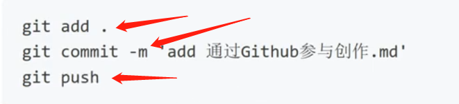

### 1、对于git程序理解：

原来就是一个管理文件工具，方便跟像github网站（具有分仓功能的网站）传输和更新文件。

下图是git常用命令 分别是：第一个保存；第二个是建立时间点 ；第三个是传过去更新。

感觉就是把文件分开放 C盘 D盘一回事，只不过它只显示一个盘的文件，另外盘全部隐藏。然后你要操作先要选好盘，恢复也是按照这个盘来恢复，一个盘相当于一个branch（分枝）。

备注几个常用命令： git status         查看分支所有文件是否变化状态

​                                   git init              对文件初始化=====不知道怎么用

​                                  git push 服务器名称 master(分支名称)

​                                  git branch                    查看分支

​                                 git checkout 分支名称  

版本追溯 branch  main

